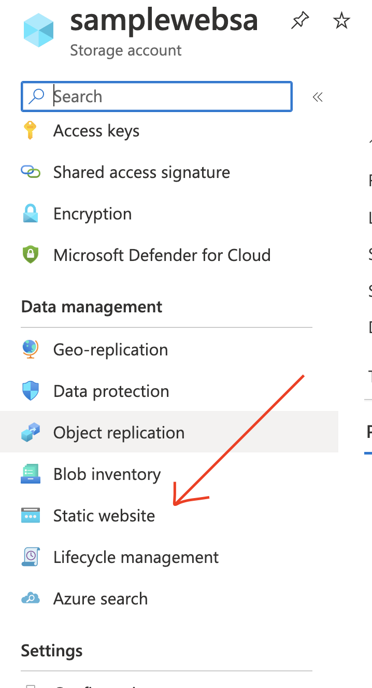
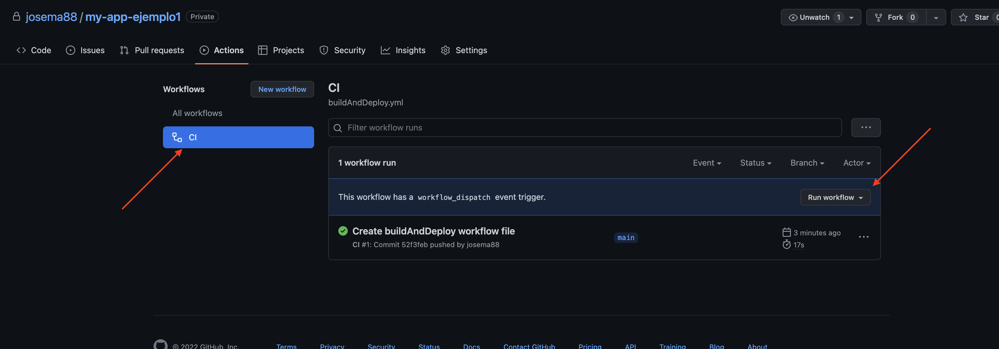
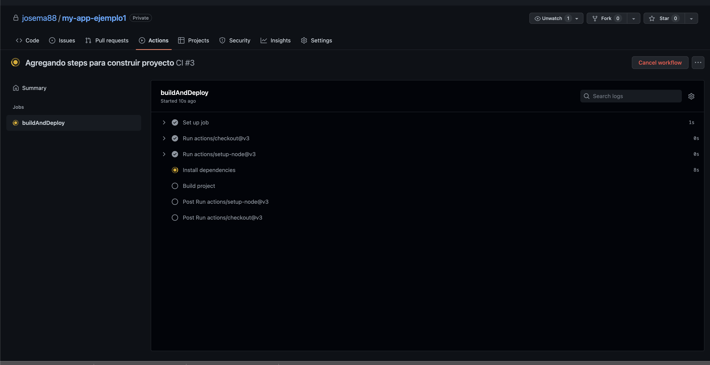
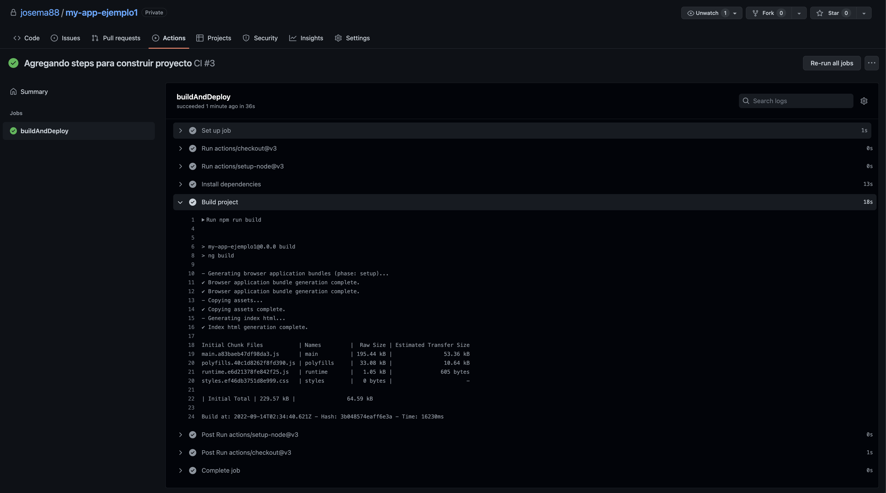
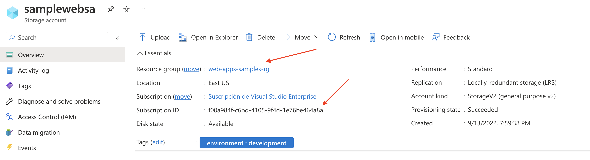
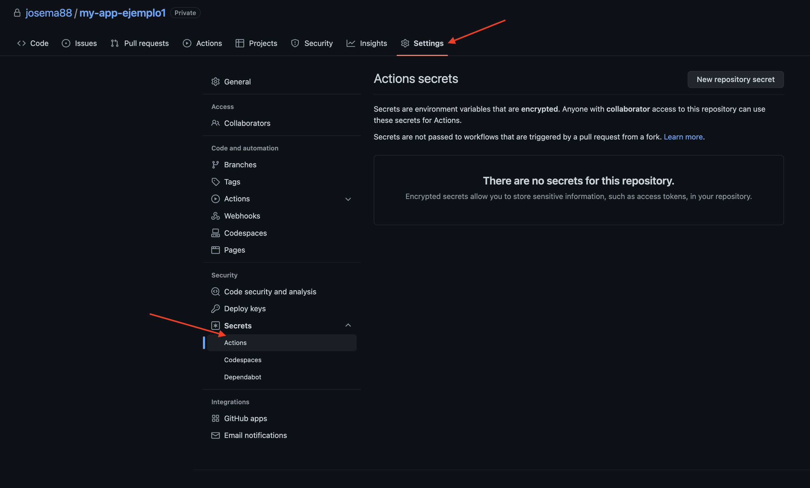
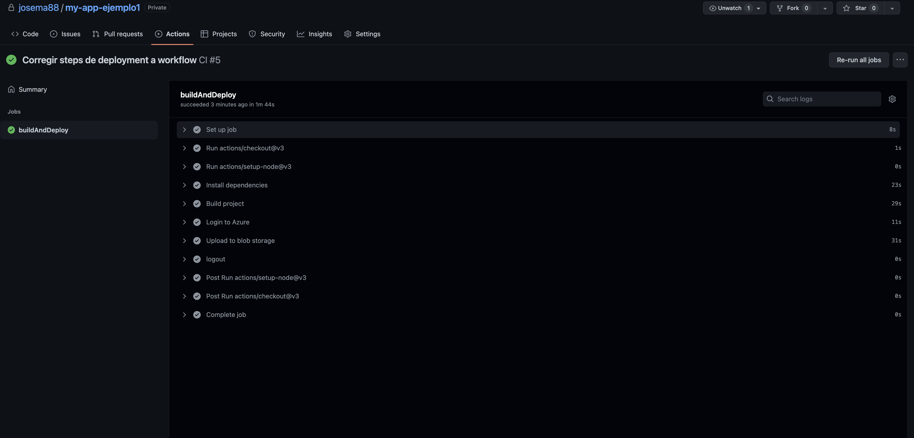
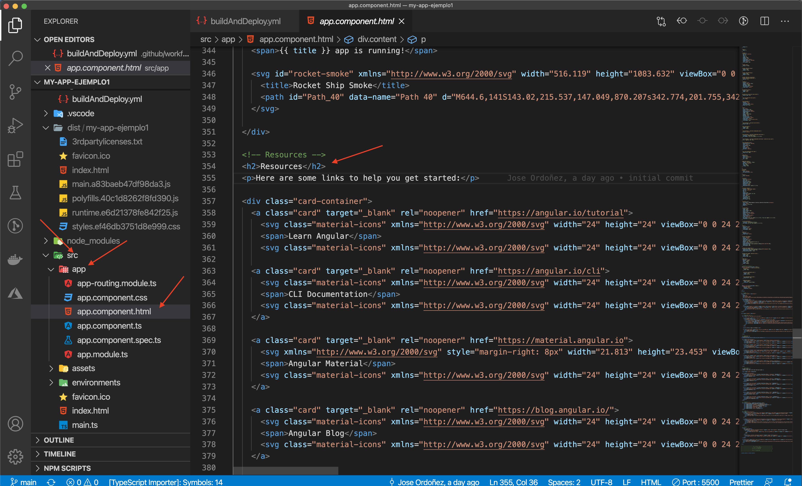

# Construye y publica tu web app Angular hacia Azure con Github Actions

## Crea tu proyecto Angular y tu repo en Github

Crea un proyecto de Angular.

```jsx
ng new my-app-ejemplo1

cd my-app-ejemplo1

```

Ejecuta localmente la App de Angular.

```jsx
npm start
```

[Crea tu repositorio en GitHub.](https://docs.github.com/es/get-started/quickstart/create-a-repo)

Enlaza a un repo de GitHub a la carpeta del codigo (la url del repo debe tener el nombre de tu usuario y proyecto).

```bash
git remote add origin git@github.com:gitHubUser/my-app-ejemplo1.git
git branch -M main
git push -u origin main
```

## Crea el recurso de Azure Blob Storage

Crear storage account en Azure y habilitar static web



Sube al recurso un archivo HTML para probar, por ejemplo un archivo `index.html` con el siguiente contenido:

```html
<html>
	<head>
		<title>Mi página de ejemplo</title>
	</head>
	<body>
	Aquí va el contenido
	</body>
</html>
```

Realiza una prueba de tu Static Website, obtén la url y trata de abrirlo en el explorador. Te debe mostrar el cotnenido del archivo subido.

## Crea tu workflow y configuralo

Crea un workflow desde portal de github. Ingresa al proyecto de tu repo y ve a la opcion Actions, crea un workflow desde cero.

Realiza commit del cambio desde el portal.

Regresa a la consola de tu computadora y realiza un pull del repo para tener el ultimo cambio.

```bash
git pull
```

Prueba el workflow ejecutandolo manualmente desde el portal de GitHub.



Modificar el workflow para hacer build de nuestro proyecto

```yaml
# This is a basic workflow to help you get started with Actions

name: CI-CD

# Controls when the workflow will run
on:
  # Triggers the workflow on push or pull request events but only for the "main" branch
  push:
    branches: [ "main" ]

  # Allows you to run this workflow manually from the Actions tab
  workflow_dispatch:

# A workflow run is made up of one or more jobs that can run sequentially or in parallel
jobs:
  # This workflow contains a single job called "buildAndDeploy"
  buildAndDeploy:
    # The type of runner that the job will run on
    runs-on: ubuntu-latest

    # Steps represent a sequence of tasks that will be executed as part of the job
    steps:
      # Checks-out your repository under $GITHUB_WORKSPACE, so your job can access it
      - uses: actions/checkout@v3

      - uses: actions/setup-node@v3
        with:
          node-version: 16

      # Runs a single command using the runners shell
      - name: Install dependencies
        run: npm install

      # Runs a set of commands using the runners shell
      - name: Build project
        run: |
          npm run build
```

Probar workflow automatizado haciendo commit de los cambios.

```bash
git add .
git commit -m "Agregando steps para construir proyecto"
git push
```

Ver en portal la ejecucion de la accion de forma automatica.



El workflow se debe ejecutar correctamente.



Ahora llegamos a un punto importante en nuestro flujo de trabajo, que es desplegar nuestro sitio web hacia Azure y que nos lleva a la pregunta ¿como conectarse a Azure?.

Para conectarnos a Azure debemos generar una **identidad** (técnicamente llamada **service principal**) dentro de nuestra subscripcion de Azure, la cual permitirá conectar el Workflow de GitHub con Azure para manipular recursos o en nuestro caso, subir los archivos de nuestro sitio web a Blob Storage.

Referencia:
[https://docs.microsoft.com/en-us/azure/storage/blobs/storage-blobs-static-site-github-actions?tabs=userlevel#code-try-0](https://docs.microsoft.com/en-us/azure/storage/blobs/storage-blobs-static-site-github-actions?tabs=userlevel#code-try-0)

### Genera credenciales para despliegue

Puedes crear un [service principal](https://docs.microsoft.com/en-us/azure/active-directory/develop/app-objects-and-service-principals#service-principal-object) con el comando [az ad sp create-for-rbac](https://docs.microsoft.com/en-us/cli/azure/ad/sp#az-ad-sp-create-for-rbac) en el [Azure CLI](https://docs.microsoft.com/en-us/cli/azure/). Puedes ejecutar el comando desde el [Azure Cloud Shell](https://shell.azure.com/) en el portal de Azure.

Reemplaza `myStaticSite` con el nombre de tu recurso hospedado en Azure Storage y reemplaza los id de la subscripcion y resource group.



Comando para crear service principal:

```bash

az ad sp create-for-rbac --name {myStaticSite} --role contributor --scopes /subscriptions/{subscription-id}/resourceGroups/{resource-group} --sdk-auth
```

Debemos tener una salida como esta, con sus respectivos datos:

```bash
{
    "clientId": "<GUID>",
    "clientSecret": "<GUID>",
    "subscriptionId": "<GUID>",
    "tenantId": "<GUID>",
    (...)
  }
```

Guarda ese contenido JSON, ya que servirá para el siguiente paso.

### Crea un secret en tu repo de GitHub

1. En [GitHub](https://github.com/), busca tu repositorio.
2. Selecciona **Settings > Secrets > New secret**.
3. PPega todo el JSON del comando de Azure CLI del paso anterior en el campo de valor del secreto. Dale un nombre como `AZURE_CREDENTIALS`.



### Actualiza tu Workflow haciendo referencia al Secret creado

Cuando configures tu workflow, utiliza el secreto para el input  `creds`  de la accion de Azure Login.

Actualiza tu YAML para agregar las **Acciones** que se encargarán de realizar el login a Azure, subir los archivos del sitio web y hacer logout de Azure. El archivo debería quedar de la siguiente manera:

```yaml
# This is a basic workflow to help you get started with Actions

name: CI-CD

# Controls when the workflow will run
on:
  # Triggers the workflow on push or pull request events but only for the "main" branch
  push:
    branches: [ "main" ]

  # Allows you to run this workflow manually from the Actions tab
  workflow_dispatch:

# A workflow run is made up of one or more jobs that can run sequentially or in parallel
jobs:
  # This workflow contains a single job called "buildAndDeploy"
  buildAndDeploy:
    # The type of runner that the job will run on
    runs-on: ubuntu-latest

    # Steps represent a sequence of tasks that will be executed as part of the job
    steps:
      # Checks-out your repository under $GITHUB_WORKSPACE, so your job can access it
      - uses: actions/checkout@v3

      - uses: actions/setup-node@v3
        with:
          node-version: 16

      # Runs a single command using the runners shell
      - name: Install dependencies
        run: npm install

      # Runs a set of commands using the runners shell
      - name: Build project
        run: |
          npm run build

      - name: Login to Azure
        uses: azure/login@v1
        with:
          creds: ${{ secrets.AZURE_CREDENTIALS }}

      - name: Upload to blob storage
        uses: azure/CLI@v1
        with:
          inlineScript: |
              az storage blob upload-batch --overwrite --account-name <STORAGE_ACCOUNT_NAME> --auth-mode key -s $GITHUB_WORKSPACE/dist/my-app-ejemplo1 -d '$web'

      # Azure logout
      - name: logout
        run: |
              az logout
        if: always()
```

Sube tus cambios al repositorio.

```bash
git add .
git commit -m "Agregar steps de deployment a workflow"
git push
```

Verifica la ejecución automatica del workflow.



Todos los pasos deben de haber sido ejecutados correctamente y el sitio web debe estar publicado..


Ahora realiza una prueba más: modifica un archivo de tu proyecto, publica tus cambios a git y el workflow debe ejecutarse de manera automática.

Por ejemplo, modificar el archivo HTML `app.component.html`.



Por último, publicar cambios a repo para activar el workflow y verifica que el workflow se haya ejecutado correctamente y que los cambios esten publicados tu recurso de Azure.

Y eso es todo!. Ya tienes tu worflow creado y configurado correctamente.